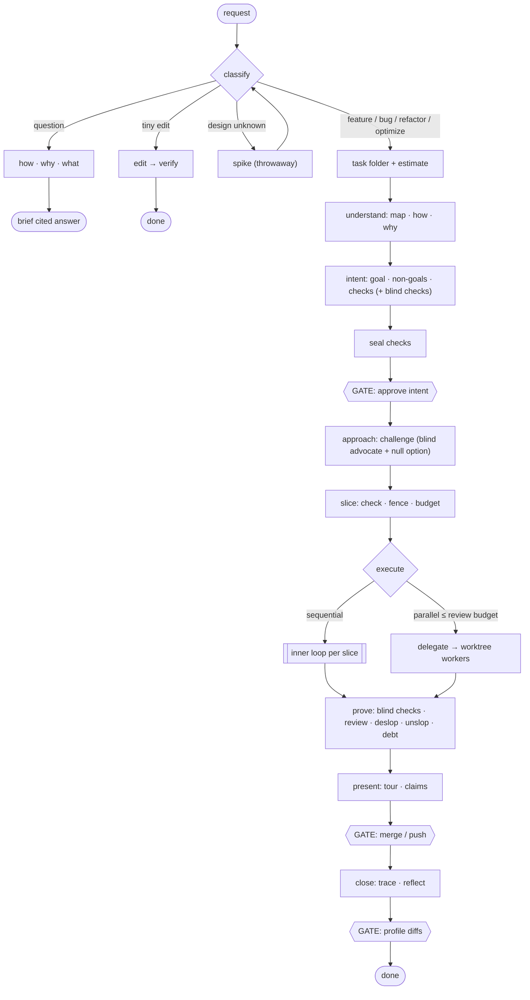

# flow-stack

**Spend human attention like money.** flow-stack is a Claude Code plugin that makes the agent define "done" before coding, prove its work with evidence it can't fake, stop fixating on its first idea, prefer deleting code to adding it, and keep a trail you can audit. It adapts to the tools you already use.

It is built from skills, bash + jq hooks, and existing tools. There is no new runtime. It was inspired by [gstack](https://github.com/garrytan/gstack), [pstack](https://github.com/cursor/plugins/tree/main/pstack), and [mattpocock/skills](https://github.com/mattpocock/skills).

- [Quick start](#quick-start)
- [Architecture](#architecture)
- [How you use it day to day](#how-you-use-it-day-to-day)
- [When to use what](#when-to-use-what)
- [Skill catalog](#skill-catalog)
- [What it costs, and how it keeps cost down](#what-it-costs-and-how-it-keeps-cost-down)
- [Guardrails (hooks)](#guardrails-hooks)
- [Mods (UI inside Claude Code)](#mods-ui-inside-claude-code)
- [How it works](#how-it-works)
- [Feature map](#feature-map) · [Your profile](#your-profile) · [Adapting to your setup](#adapting-to-your-setup) · [Agent hosts](#agent-hosts-herdr-orca-cmux) · [Forge](#forge-skills-specific-to-your-repo)
- [Files](#files) · [Limits](#limits) · [Development](#development) · [FAQ](#faq)

## Quick start

```bash
# inside Claude Code
/plugin marketplace add nayanraj210401/flow-stack
/plugin install flow-stack@flow-stack
/flow-stack:setup
```

`setup` learns your existing toolchain, creates `~/.flow-stack/profile.md` from a preset, and offers the helper tools you're missing. It asks before installing anything.

For local development: `claude --plugin-dir ./plugins/flow-stack`.

Requirements: `jq`, `git`, `perl`, `curl`, and `shasum` (standard on macOS and most Linux). Optional tools `setup` can install: rtk, serena, headroom, graphify, ccusage, Playwright MCP, and ntfy.

## Architecture

```mermaid
flowchart LR
    YOU(["👤 You<br/>request<br/>+ 3 gates:<br/>intent · merge<br/>profile changes"])

    subgraph L1["① Context · ~2k tokens"]
        PROF["profile.md<br/>who · rules · taste<br/>toolchain · rigor"]
        REPO["repo/.flow/<br/>taste · map · lessons<br/>gates · playbooks"]
        FEAT["feature map<br/>.flow/features/<br/>features · entries · owns"]
        YOURS["your tools<br/>pstack · gstack · rtk<br/>serena · Playwright"]
        FORGE["🔨 forge (you run)<br/>setup · make-verifier<br/>make-gates · tend"]
    end

    subgraph L2["② Hooks · 0 tokens"]
        H1["SessionStart<br/>anchor"]
        H2["guard<br/>read-guard"]
        H3["seal · fence<br/>slice gate"]
        H4["trail<br/>circuit breaker"]
        H5["claims check<br/>pre-compact"]
    end

    subgraph L3["③ Skills"]
        FLOW["🧭 flow<br/>classify → playbook<br/>feature · bug · refactor<br/>optimize · spike"]
        OUTER["outer loop<br/>understand → intent<br/>→ challenge → slice<br/>→ prove → present<br/>→ close"]
        LOOP["🔁 loop per slice<br/>red → subtract → build<br/>→ verify → probe<br/>→ proof gate"]
        SUPPORT["on demand<br/>brief · gate · budget<br/>handoff · debt · tdd<br/>diagnose · principles"]
    end

    subgraph L4["④ Workers"]
        AG["subagents · model per role<br/>advocate · checker<br/>reviewer · worker"]
        SC["⚙ scripts · 0 tokens<br/>task.sh · evidence.sh<br/>seal · probe · diffstat<br/>blind-run · trace-stats"]
    end

    subgraph L5["⑤ Task memory<br/>.flow/tasks/slug/"]
        T1["INTENT · SLICES"]
        T2["SEALS · blind/"]
        T3["EVIDENCE<br/>DECISIONS"]
        T4["trail.jsonl"]
        T5["HANDOFF · TRACE"]
    end

    YOU ==> L1 ==> L2 ==> L3 ==> L4 ==> L5
```



Read it left to right. A request passes through five layers:

1. **Context.** At session start, a hook injects about 2k tokens: your profile (rules, taste, which of your tools to use, how much ceremony you want), the repo's `.flow/` files (including the feature map), and your Toolchain delegations. The forge skills, which you run yourself, generate the repo-specific parts.
2. **Hooks.** These wrap every tool call and cost no model tokens. They block destructive commands and secret reads, protect sealed checks, keep edits inside the slice's fence, gate "done" on proofs, log the trail, break fix-loops, and refuse an unverified "done".
3. **Skills.** `flow` classifies the request and runs a playbook. Its outer loop goes understand → intent → challenge → slice → prove → present → close, and each slice runs the inner `loop`. The other skills load only when a step needs them.
4. **Workers.** Judgment goes to subagents (advocate, checker, reviewer, worker), each on the profile's `budget:` model for its role. Bookkeeping goes to shell scripts, which cost 0 tokens.
5. **Task memory.** Everything lands in `.flow/tasks/<slug>/`: intent, sealed checks, evidence, decisions, the tool-call trail, and the handoff and trace. A fresh session resumes from these files, not from chat history.

The diagrams are Mermaid. GitHub renders them. VS Code's built-in preview doesn't, unless you install a Mermaid extension such as "Markdown Preview Mermaid Support".

## How you use it day to day

**Mostly, you just talk.** You don't need to remember skill names:

- **Ask a question** ("how does auth work?"): a short, cited answer. No ceremony.
- **Ask for a one-line fix**: the agent makes it and runs the check.
- **Ask for a feature, a bug fix, a refactor, or a speed-up**: the agent invokes `flow`, which picks a playbook and runs it. You get **three decision points**:
  1. approve the intent and checks,
  2. approve the merge or push,
  3. approve any changes it proposes to your taste profile.
  It asks between them only when a decision is irreversible or a matter of taste.
- **The hooks run on every tool call either way.** They cost no model tokens. They block destructive commands and secret reads, stop tests from being weakened, keep edits in scope, catch fix-loops, and refuse an unverified "done".

Type a skill yourself when you want a specific thing: `/flow-stack:challenge`, `/flow-stack:brief`, `/flow-stack:wrap`.

## When to use what

| Situation | Use | You'll get |
|---|---|---|
| New feature, multi-file change | just ask, or `/flow-stack:flow` | intent → approach → slices → proof → a short review tour |
| "What does this app do, and how do we prove it?" | `/flow-stack:feature-map` | one file per user-facing feature: sub-feature IDs, every entry point, the code it owns, a scenario |
| "What does my change affect?" | `features.sh impact` (flow runs it for you) | the features your diff touches, plus changed code no feature owns |
| Bug with an unknown cause | just describe it, or `/flow-stack:diagnose` | a reproduction first, then the root cause, then a fix with a regression check |
| Refactor, rename, migration | `/flow-stack:flow` (refactor playbook) | behavior pinned first; kept only if the code gets easier to read |
| Make something faster, smaller, cheaper | `/flow-stack:flow` (optimize playbook) | one change, one measurement, keep or revert |
| Not sure what to build | `/flow-stack:flow` (spike playbook) | 2 or 3 throwaway prototypes and a recommendation |
| "Is there a better way?" / you suspect over-engineering | `/flow-stack:challenge` | an independent design plus the delete/reuse/skip option, as a table |
| "What exactly are we building?" | `/flow-stack:intent` | INTENT.md with runnable acceptance checks |
| "How does X work?" / "Why is it like this?" | `how` / `why` | a cited answer (`file:line`, commits, PRs) |
| Understand something deeply | `/flow-stack:teach` | an explanation at your level, then a question to check you got it |
| "What changed?" / catching up | `/flow-stack:what` | the shape of a diff, PR, or the agent's session in about 8 lines |
| Prove it works | `/flow-stack:verify` | evidence recorded from the real app, not "it compiles" |
| Before you review a diff | `/flow-stack:tour` | what to read, skim, or skip, and why |
| Reply too long | `/flow-stack:brief` | the last reply in 3 plain lines |
| Clean up a diff / prose | `/flow-stack:deslop` / `/flow-stack:unslop` | slop removed, graded against your taste |
| Context filling up / stopping for the day | `/flow-stack:handoff` | HANDOFF.md; the next session starts with `/flow resume` |
| "What did we decide about X?" | `/flow-stack:recall` | a short brief from past conversations and flow's records, your own words quoted |
| Many independent slices | `/flow-stack:delegate` | parallel worktree workers, capped by your review budget |
| Audit what the agent did | `/flow-stack:trace` | TRACE.md: timeline, who decided what, evidence, cost |
| End of day | `/flow-stack:wrap` | shipped, waiting on you, and your first step tomorrow |
| See everything at once | `/flow-stack:board` | one private artifact link, refreshed in place: what needs you, tasks, features, decisions, debt, spend; your layout, theme, and custom panels persist in the profile's `# Board` section |
| After a frustrating session | `/flow-stack:reflect` | proposed taste and lesson updates you approve |
| New repo | `/flow-stack:setup` → `/flow-stack:feature-map` → `/flow-stack:make-verifier` | a driver that proves this app works the way a user uses it |
| Installed a new plugin or hook | `/flow-stack:setup adapt` | flow-stack re-fits itself around your toolchain |

## Skill catalog

**Invoked** says who triggers the skill:
- *auto*: the model picks it up from context.
- *flow*: `flow` calls it at the right step.
- *you*: you type it (these don't appear in the model's skill list, which saves tokens).

**Agent** means the skill spawns a subagent, the most expensive kind of step. Its model comes from the profile's `budget:` for that role.

### Orchestration

| Skill | Invoked | What it does |
|---|---|---|
| `flow` | auto · you | **The operating mode and orchestrator** (like pstack's poteto-mode). It holds a routing table from situation to skill, classifies the request, and runs a playbook (feature, bug, investigate, refactor, optimize, spike, multi-session, or your repo's own) with human gates. It scales ceremony by `rigor`, sets autonomy (interactive / autonomous / quick), and holds the subagent rules. |
| `loop` | flow | The inner loop for one slice: red → subtract scan → build → verify → probe → proof-gated done, with a circuit breaker. |

### Define

| Skill | Invoked | What it does |
|---|---|---|
| `intent` | auto · flow | A short grilling interview (it answers from the code whatever the code can answer) → INTENT.md with goal, non-goals, and runnable checks. Blind checks are written by the `checker` agent. **Agent** (blind checks only) |
| `challenge` | auto · flow | Breaks fixation. The `advocate` agent designs from the goal alone, never seeing our approach, then attacks ours. The null option (delete, reuse, configure, don't build) is always weighed. **Agent** |
| `slice` | flow | Splits the work into slices, each with one check, a file fence, and a line budget. The first slice is a thin end-to-end tracer. |

### Understand

| Skill | Invoked | What it does |
|---|---|---|
| `how` | auto | How code works: runtime flow, ownership, where a change belongs. Cites `file:line`. |
| `why` | auto | Why it's built this way, from git log and blame, PRs, issues, and docs, with a confidence level. |
| `what` | auto | A summary of a diff, PR, branch, module, or the agent's session. |
| `recall` | auto · you | What happened in earlier conversations in this repo: flow's records first, then `recall.sh` searches past Claude Code transcripts (your prompts and Claude's replies only, redacted) and checks what it finds against git and gh. |
| `teach` | auto · you | A deep explanation at your level (from the profile), ending with a check for understanding. |
| `map` | auto · flow | Builds `.flow/map.md` once, so later sessions read it instead of re-exploring the repo. |

### Verify

| Skill | Invoked | What it does |
|---|---|---|
| `verify` | auto · flow | Runs checks on the real artifact through `evidence.sh` (the only way to write EVIDENCE.md), runs the scenarios of **the features your diff touches**, uses your repo's driver, and runs the blind checks. |
| `feature-map` | auto · you | Builds and maintains `.flow/features/`: one file per user-facing feature, with sub-feature IDs, every entry point, the code it `owns`, a scenario, and a proof. `features.sh` does impact, run, stale, coverage, and check in bash. |
| `seal` | flow | Hashes the approved checks. Editing one then needs your confirmation. |
| `probe` | flow | Reverts the change and re-runs the check. If it still passes, the check proves nothing (TOOTHLESS). |
| `tdd` | auto | Red → green → refactor for fast checks. The slice-done gate enforces the cadence. |
| `diagnose` | auto · flow | Reproduce as a failing check → hypotheses → observations → root cause. No symptom patches. |
| `review` | flow · you | The `reviewer` agent grades the diff against INTENT, EVIDENCE, and your taste, and asks whether fewer lines could do it. **Agent** |

### Attention (your time)

| Skill | Invoked | What it does |
|---|---|---|
| `brief` | always on · you | The reply contract: answer first, ≤ 5 lines. `/brief` restates the last reply plainly. |
| `tour` | flow · you | A risk-ranked diff: READ / SKIM / SKIP with reasons, net lines, and estimated review minutes. |
| `gate` | auto | Classifies decisions: reversible ones proceed and are logged; irreversible or taste ones are asked, batched into one message, and you're notified. |
| `claims` | auto | Tags every statement `✓ verified (evidence)` or `~ assumed`. The Stop hook enforces it for "done". |

### Quality

| Skill | Invoked | What it does |
|---|---|---|
| `deslop` | auto · flow | Removes code slop from the diff (narrating comments, dead code, defensive clutter, one-caller wrappers, duplicate helpers). Behavior must stay green. |
| `unslop` | auto · flow | Removes AI tells from replies, commits, PRs, and docs. |
| `debt` | flow · you | A ledger of shortcuts taken, each with a repay trigger. |
| `principles` | auto | 18 principles (design-it-twice, subtract-before-add, red-before-green, evidence-over-claims, …). Each loads on demand as one short file. |

### Context, scale, audit

| Skill | Invoked | What it does |
|---|---|---|
| `budget` | auto · you | Context and cost rules (subagents for bulk reading, cheap models, symbol reads, the handoff threshold). `/budget` reports spend. |
| `handoff` | auto · you | Writes HANDOFF.md for a cold resume. `/handoff resume` loads it. |
| `delegate` | you · flow | Parallel worktree `worker` agents, capped by `attention.max_parallel_agents`. A result is accepted only with evidence and a review. **Agent** |
| `trace` | flow · you | Writes TRACE.md from the trail, decisions, evidence, git, and cost, including estimate vs. actual. |
| `reflect` | flow · you | Proposes taste, lesson, and calibration updates from your corrections. Prefers encoding a lesson as a lint rule over prose. |
| `dojo` | flow · you | Keeps your skills sharp: leaves a `TODO(you)` piece, or asks an explain-back question. Off by default. |

### Setup and forge (you invoke these)

| Skill | What it does |
|---|---|
| `setup` | Learns your toolchain and usage, adapts to it, creates your profile, offers tools, and runs a forge census. `/flow-stack:setup adapt` re-fits after changes. |
| `profile` | Shows, edits, or lints `~/.flow-stack/profile.md`. |
| `wrap` | End-of-day digest across your repos. |
| `make-verifier` | Generates `.claude/skills/verify-<repo>/`, a driver that runs this app like a user (CLI, HTTP, browser) and proves itself on a real feature. |
| `make-runner` | Generates `.claude/skills/run-<repo>/` with verified install, start, seed, reset, and stop commands. |
| `make-playbook` | Generates `.flow/playbooks/<name>.md` from past traces, for workflows this repo repeats. |
| `make-gates` | Generates `.flow/gates.md`: this repo's irreversible commands as deny/ask rules the guard hook enforces. |
| `make-skill` | Generates any other repo or personal skill, with a self-test. |
| `tend` | Re-runs every generated skill's self-test and flags drift against the code. |

### Agents

| Agent | Spawned by | Sees |
|---|---|---|
| `advocate` | challenge | the problem only (design mode), then our approach (attack mode) |
| `checker` | intent | INTENT; writes held-out blind checks and returns only a count |
| `reviewer` | review | INTENT, the diff, EVIDENCE, taste; read-only |
| `worker` | delegate | one slice, in its own worktree; never the blind checks |
| `flow-agent` | any other delegated step | loads `flow` first, so fences, evidence, and gates hold in delegated work |

## What it costs, and how it keeps cost down

flow-stack writes files and makes decisions, and that costs something. These are the numbers, measured with `claude plugin eval` against the same tasks without the plugin.

### Measured overhead

| | Tokens | When |
|---|---|---|
| Skill list the model sees | ≈ 1.75k | every session (cached after the first turn) |
| SessionStart context (profile, rules, taste, active task) | ≈ 0.3–0.5k | every session |
| Intent anchor | ≈ 40 | every prompt, only while a task is active |
| `flow` + a playbook + conventions | ≈ 3.6k | only when a non-trivial task starts |

On small eval tasks, where fixed overhead dominates, a session with the plugin costs **1.43×** a plain session on average. That was **1.78×** before the optimizations below.

| Kind of task | With / without |
|---|---|
| Quick question / feature routing | 1.1× |
| Intent writing | 1.0× |
| One-turn replies | 1.2–1.5× (about +$0.02 fixed) |
| `challenge` (spawns an agent) | 2.8× |

The numbers above are the price side. The value side is what the evals show the plugin prevents:
- weakened tests (the seal case fails without the plugin),
- `.env` secrets reaching the transcript,
- helpers duplicated instead of reused (the least-code case scores 0.33 without the plugin, 1.0 with it),
- new modules built when one already existed.

A rework loop or a wrong approach usually costs more than the overhead. Judge it on your own traces: `trace` records estimate vs. actual for every task.

### How cost is kept down

1. **Bookkeeping is bash, not the model.** Evidence, seals, probes, blind-check runs, the audit trail, the auto handoff, diffstat, and the slice-done proofs are shell scripts and hooks. They cost zero model tokens, which is why no rigor level turns them off.
2. **Small always-on footprint.** The 18 principles are one skill with on-demand files. The nine skills you invoke yourself (setup, forge, wrap…) are hidden from the model's list. Descriptions are kept to their trigger phrases. Together these cut the always-on listing from about 4.8k to about 1.6k tokens.
3. **Ceremony scales with the task.** Questions and one-line edits skip the task folder entirely. For real tasks, `rigor` in your profile decides what runs:

   | Step | lean | standard (default) | strict |
   |---|---|---|---|
   | Blind checks (agent) | skip | when a contract changes | always |
   | `challenge` (agent) | on request, or when the circuit trips | multi-slice features and refactors | every task |
   | `review` (agent) | only for diffs over 300 lines | one reviewer | one per area, in parallel |
   | Evidence, seals, probe, slice gate (bash) | on | on | on |
   | Trace / reflect | on request | at close | at close |

   The solo-hacker preset uses `lean`. Override per task by saying "quick" or "go strict".
4. **Cheaper models where judgment isn't needed.** Each spawn names its model from `budget:`: `design_model` for review and design, `build_model` for building, `subagent_model` (default Haiku) for exploration. The agents pin no model, so a spawn that names none inherits the session's.
5. **Files instead of re-reading.** `map.md` replaces re-exploring the repo each session. HANDOFF.md replaces a lossy compaction. The anchor re-injects 3 lines instead of re-reading INTENT.
6. **Loops are stopped early.** The circuit breaker trips after the same failure three times, the most expensive pattern in agent work.
7. **Uses what you already have.** `setup` records your token savers (rtk, headroom, serena) and delegates to tools you already pay for, instead of duplicating them.

Check your own spend with `/flow-stack:budget` (uses ccusage) and the estimate-vs-actual row in each TRACE.md.

## Guardrails (hooks)

| Hook | Blocks or does |
|---|---|
| **guard** (Bash) | Denies `rm -rf /`, force-push to main, reading `.env`, and packages that don't exist on npm or PyPI (hallucinated dependencies). Asks you before `reset --hard`, destructive SQL, `curl \| sh`, and anything in your repo's `.flow/gates.md`. |
| **seal** (Edit, Write, Bash) | Editing a sealed check, INTENT.md, or SEALS needs your confirmation. |
| **fence** (Edit, Write) | Edits outside the current slice's file fence are denied until the fence is widened on purpose and logged. |
| **holds** (Edit, Write) | Two Claude sessions on different tasks, in any worktrees of one repo, editing the same file: the first to edit it holds it. The second is warned once (`soft`, the default) or denied (`{"holds": "hard"}`), told who holds it, and pointed at `SendMessage` to sort it out. Its band shows `⚡ <file> · <holder>`. A hold lapses when the holder's slice is done, its session ends, or after 30 minutes without an edit (`holds_ttl`, seconds). |
| **blind / read-guard** | Blind checks and `.env` files can't be read by the builder. |
| **slice gate** | `status: done` can only be set by `task.sh slice <id> done`, which requires red first, green after the last edit, probe TEETH, and the line budget. |
| **circuit** (PostToolUse) | The same failing check 3 times → stop, attack the premise, `challenge`, and ask you. |
| **trail** (PostToolUse) | Every tool call goes to `trail.jsonl` with secrets redacted. |
| **claims** (Stop) | "Done", "works", or "fixed" with no passing evidence since the last edit → sent back once to verify or say `~ assumed`. |
| **anchor** (UserPromptSubmit) | A 3-line goal and slice reminder on every prompt while a task is active. |
| **session-start / pre-compact / notify** | Profile and toolchain context; a handoff snapshot before compaction; a notification when the agent is blocked on you. |

Hooks fail open: if `jq` is missing or a script errors, the action is allowed and a warning goes to `~/.flow-stack/hooks.log`. Turn any hook off in `.flow/config.json` (repo) or `~/.flow-stack/config.json` (global): `{"hooks": {"fence": false}}`.

## Mods (UI inside Claude Code)

`hooks/register.tsx` is a [mod](https://code.claude.com/docs/en/plugins/mods/overview): code that runs inside Claude Code (2.1.287+), next to the bash hooks. It changes no guard. It draws only in the terminal and the Desktop app; in VS Code chat and `claude -p` nothing draws, but model per role still applies.

| Mod | What you get | Reads |
|---|---|---|
| **Flow band** | A dim line above the prompt: `flow · <task> · <slice> · n/m slices · tdd red · C1 PASS · edited since`, and `⚡ <file> · <holder>` while another session holds a file you edited. Empty when no task is active. | `status.sh` |
| **Spinner** | While Claude works, the spinner shows the slice: `Thinking · S2 · red…` | `status.sh` |
| **`/flow-pane`** | A pane with slices, open gates with **Approve / Reject**, and the repo's other tasks with the session that owns each. It is a command, so it runs instantly with no Claude turn and no tokens. | `status.sh --full` |
| **Model per role** | A flow-stack agent started with no model gets one from your profile's `budget:`. advocate and reviewer get `design_model`; worker, checker and flow-agent get `build_model`. A model the call names wins. Built-ins such as Explore are left alone. A toast names the model the first time each role spawns; a budget value that isn't a model name is ignored with a warning. | `~/.flow-stack/profile.md` |

```
 ╭ flow ─────────────────────────────────────────────╮
 │ flow · rate-limit · S2 token bucket · 1/3 slices  │   ← the band's line
 │                                                   │
 │ S1 bucket            · done  · PASS               │   ← slices: status · last verdict
 │ S2 token bucket      · doing · FAIL               │
 │ S3 headers           · todo                       │
 │                                                   │
 │ GATES                                             │   ← open gates in GATES.md
 │ merge PR #3                                       │
 │ options: A) merge  B) wait   (recommend: A)       │
 │ [ Approve ]  [ Reject ]                           │
 │                                                   │
 │ TASKS                                             │   ← the repo's other tasks
 │ ● login · wt-login · flow-stack-ab (idle)         │
 ╰───────────────────────────────────────────────────╯
```

How a gate press works:

```
  agent (auto mode, or a gate it can't take)        you
  ─────────────────────────────────────────         ───
  writes  GATE · merge PR #3                       /flow-pane
          into .flow/tasks/<slug>/GATES.md   ──▶   pane lists the open gates
                                                    │
                                                 [ Approve ]
                                                    │
                                                    ▼
          task.sh gate 3 approve "merge PR #3"
            │  (refused if gate 3 changed or is already decided)
            ├─ GATES.md:  + decided: human approve <ts>
            └─ DECISIONS.tsv: who=human · approve: merge PR #3
                                                    │
                                                    ▼
  Claude reads "The human approved gate 3 in the /flow-pane"  ──▶  acts on it
```

All the data comes from bash. `status.sh` turns the task's files into one JSON line and strips control characters from repo text. It runs at session start, after each Bash, Edit, or Write call, at the end of each turn, and after a gate press, one run at a time. `--full` is added only while the pane is open. The guard denies the agent `task.sh gate`, so gates wait for your press (an agent could still edit GATES.md by hand).

## How it works

The full picture is in [Architecture](#architecture). Here are the two loops in detail.

### Outer loop (`flow`, feature playbook)



### Inner loop (`loop`)


### Anti-reward-hacking

Agents saturate visible tests while real correctness varies. flow-stack has three layers against this:

1. **Seal.** Approved checks are hashed, and changing them needs you.
2. **Probe.** A check that still passes with the change reverted is TOOTHLESS.
3. **Blind checks.** The `checker` agent writes held-out checks that the builder can't read. `blind-run.sh` reports only the verdict and the failing test names.

In testing, a special-cased `mul() { echo 6; }` passed the visible check and failed the blind one.

## Feature map

The feature map is the repo's user-level answer to *what can a user do here, and how do we prove each part still works?* It lives in `.flow/features/`, one file per feature:

```markdown
---
id: auth.login
title: Log in
owns: src/auth/** src/routes/login.ts                        # the code behind it
entries: web /login | api POST /api/session | cli acme login  # every way in
scenario: bash .claude/skills/verify-acme/scripts/login.sh    # the proof command
status: verified                                              # verified | stale | broken | unverified
verified: 2026-09-27 a1b2c3d
---
## Sub-features       - auth.login.lockout · 6th failure in 15 min returns 423, no cookie
## How to get to it   ## Driving it   ## Proof   ## Gotchas
```

The `owns:` link turns the map from documentation into something the workflow uses:

| Step | Uses the map to |
|---|---|
| flow, Understand | name the features in play (`features.sh impact`) |
| intent | cite sub-feature IDs in acceptance checks (`C1 · auth.login.lockout`) |
| slice | seed fences from `owns:` |
| verify | run exactly the impacted features' scenarios, through every entry point (`run --impacted`) |
| review | flag an impacted feature with no check and no scenario run |
| tour | group the diff by feature |
| tend | mark features stale when their code changed since verification; list unowned code (`coverage`) |

`features.sh` does all of this in bash, so it costs no model tokens: `list`, `impact`, `run`, `stale`, `coverage`, `check`, `index`, `new`. Build the map with `/flow-stack:feature-map`; `/flow-stack:make-verifier` writes one scenario per feature.

## Your profile

`~/.flow-stack/profile.md` is created by `setup` from a preset: senior-backend, frontend-product, data-ml, learning-mode, or solo-hacker.

| Section | Used for |
|---|---|
| frontmatter | attention budget, models, `rigor`, notifications, `dojo` |
| Who | how deep explanations go |
| Repos | only the current repo's entry is injected |
| Rules | ≤ 20 hard constraints, always injected |
| Taste | dated, sourced preferences; the rubric for deslop, unslop, review, and brief |
| Toolchain | how flow-stack fits your other tools |
| Keep-sharp | what `dojo` leaves to you |
| Calibration | estimate vs. actual, learned by `reflect` |

Taste evolves: `reflect` proposes changes from your corrections, you approve each one, and retired entries move to `# Taste history`. Repo taste (`.flow/taste.md`) overrides personal taste.

## Adapting to your setup

`setup` starts by learning your toolchain:
- installed plugins, with their skills and hooks,
- your own hooks,
- MCP servers,
- your status line,
- your CLAUDE.md,
- and, from local transcripts, **what you actually use**.

Then it fits around it:

- **One router.** If you use `pstack:poteto-mode`, it stays your router, and flow-stack stops pushing `flow`.
- **Delegation.** Capabilities you already cover go to your tool (`how → pstack:how`, `verify-driver → gstack /qa`). Seals, evidence, claims, the trail, and gates stay with flow-stack.
- **Coexistence.** Your status line is chained, not replaced. Overlapping hooks are noted or turned off.
- **Recorded** as `# Toolchain` lines in your profile. A fingerprint detects toolchain changes, and the next session suggests `/flow-stack:setup adapt`.

## Agent hosts (herdr, Orca, cmux)

[herdr](https://herdr.dev), [Orca](https://github.com/stablyai/orca) and cmux run Claude Code in panes and worktrees. flow-stack runs inside them unchanged. Inside one, it also:

- **Shows flow's phase in the host's sidebar.** The host already knows whether Claude is working, blocked or done. flow adds the task, slice and open gates: herdr pane labels (`$flow_task $flow_slice $flow_gates`), an Orca worktree comment (marked unread when a gate opens), a cmux status. Pushed only when they change, only by the session that owns the task (another pane in the same checkout shows none), and cleared when the task or session ends.
- **Leaves the desktop ping to the host.** flow's macOS notification is skipped, since the host sends its own. ntfy and `notify_on: all` still fire.
- **Runs workers where you can see them** (opt-in, `- delegate: herdr-panes`). `delegate` starts each slice's worker in its own herdr worktree and pane instead of a hidden subagent; you can watch and steer it. Each new worktree asks Claude's folder-trust question once; answer it in the pane, then `dispatch.sh brief <lane>` sends the slice. The lead accepts it as before, then removes the worktree if it is clean. A worker pane runs like `--auto`: push, merge and PRs wait in GATES.md for you, since its prompts come from the lead, not from you.
- **Works under a coordinator.** With herdr-projects or Orca's orchestrator starting threads, each thread is a normal flow lead in its own worktree, with its own active task.

`setup` detects hosts and offers, one at a time, what's missing: herdr's Claude integration, flow's rows in herdr's sidebar, herdr-projects, and a repo-scope plugin entry so every worktree loads flow-stack. A re-run offers only what's new; a "no" is remembered. Nothing changes outside a host, and stray host variables (tmux, ssh) are ignored unless the host's socket answers. `hooks.host: false` in `config.json` turns it all off.

Limits: Orca and cmux have no expiry for status text, so a crashed session leaves its last line until the next flow session there. Windows and WSL are not supported. Conductor, Vibe Kanban and Claude Squad have no status API: flow runs there, nothing is shown.

## Forge: skills specific to your repo

Generic skills have **slots**. Forge skills generate what fills them. Resolution order: your Toolchain → repo-local → user-local → the default.

| Slot | Filled by | Lives at |
|---|---|---|
| Drive the app like a user | `make-verifier` | `.claude/skills/verify-<repo>/` |
| Build, run, reset | `make-runner` | `.claude/skills/run-<repo>/` |
| Repo workflows | `make-playbook` | `.flow/playbooks/*.md` |
| Irreversible actions | `make-gates` | `.flow/gates.md` |
| Anything else | `make-skill` | `.claude/skills/<name>/` |

Every generated skill has a `## Self-test` and a `source-commit`. `tend` re-runs the self-tests and flags drift.

## Files

```
~/.flow-stack/profile.md, config.json, toolchain.fp      you
<repo>/.flow/config.json                                  commands + hook toggles   (commit)
<repo>/.flow/{taste,gates,lessons,map,debt}.md, playbooks/                          (commit)
<repo>/.flow/features/<id>.md, README.md, .ignore         feature map               (commit)
<repo>/.flow/tasks/<slug>/   INTENT · SLICES · SEALS · blind/ · EVIDENCE · DECISIONS.tsv
                             trail.jsonl · HANDOFF · TRACE                          (gitignored)
```

## Limits

- Blind checks and the guard hook are defense in depth, not a sandbox. A determined agent with a shell can find files. They stop honest agents from fitting code to checks by accident, and make cheating visible in the trail.
- The claims check reads the last message for success words. It catches an unverified "done", not every overclaim.
- The circuit breaker only counts checks run through `evidence.sh`.
- The package-existence check needs network access (3-second timeout, fails open).
- `challenge` doesn't always fire on its own for a question with no code involved; the answer still compares options. Invoke `/flow-stack:challenge` to force it.
- Cost numbers come from small eval tasks. Long tasks spread the fixed overhead thinner, but verify on your own traces.

## Development

```bash
claude plugin validate --strict plugins/flow-stack
claude plugin test plugins/flow-stack       # the mod's tests (hooks/*.test.ts), no session needed
cd plugins/flow-stack
# behavior + cost evals against a no-plugin baseline (see evals/README.md)
claude plugin eval . --tag routing hooks define quality context forge design \
  --scaffold --allow-tools Edit Write Agent --no-publish
```

26 eval cases cover routing, hooks, intent, challenge, least-code, the feature map, quality, handoff, forge, and setup adaptation. Cases tagged `needs-bash` require a machine where Bash-granting evals are allowed.

## FAQ

**Do I have to run `/flow-stack:setup` in every repo?**
No. The profile in `~/.flow-stack/` is global. `.flow/` appears the first time a task starts in a repo: `task.sh new <slug>` creates `.flow/tasks/`, copies `.flow/config.json` from the template, and adds `.flow/ACTIVE`, `.flow/tasks/` and `.flow/trail.jsonl` to `.gitignore`. Setup's repo step adds verified `commands` and `ready` gates to that config, and offers the missing forge skills (map, feature map, verify driver, gates).

**My repo already has unit and e2e tests. What does `make-verifier` add?**
A driver: `.claude/skills/verify-<repo>/`, with one scenario per feature in `.flow/features/`. Each feature file's `scenario:` points at its scenario, so `features.sh run --impacted` runs only what a diff touches. The driver also tells a cold agent how to launch, reset and log in, records evidence for each run, is rejected if it can't catch a deliberately broken core feature, and is refreshed rather than rewritten. Unit tests stay your fast red-green loop. It doesn't reuse existing e2e specs yet, but `scenario:` is just a command, so you can point a feature at an existing spec by hand.

**What is a "driver"?**
Code that runs the app the way a user does: the CLI, HTTP calls, or a browser through Playwright. It has three parts: a fixture that starts, waits for and stops the app, one scenario per feature that fails on wrong behavior, and a SKILL.md an agent can follow cold. A unit test asks whether a function returns X; a driver asks whether the feature works when someone uses it.

**Does the verifier update itself?**
No. Run `/flow-stack:make-verifier` again: it finds the existing driver, checks for drift (self-test, stale features, features without a scenario, missing scripts), and fixes only what drifted, keeping hand edits. `/flow-stack:tend` does the same for every generated skill. Re-run it when the app changes on purpose: a new feature, route, or launch step. A failing scenario usually means the app regressed, so fix the code first.

**Where is evidence saved?**
In the active task's `EVIDENCE.md` (`.flow/tasks/<slug>/`, or `lanes/[<repo>_]<lane>/` inside it for a parallel worktree lane). Each entry has the time, label, PASS or FAIL, the command, HEAD, whether the tree was dirty, how long it took, and the last 40 lines of output. Artifacts are recorded by path, not copied. With no active task, nothing is written. `.flow/tasks/` is gitignored, so evidence stays local.

**What does `budget: 80` on a slice mean?**
80 changed lines: added plus removed, in the slice's `fence:` files, measured as uncommitted changes against HEAD. It isn't tokens. `task.sh slice <id> done` refuses a slice over budget unless you split it or pass `--force` with a reason. A slice forced through more than 50% over triggers `challenge` before the next one. It is unrelated to the profile's `budget:` (model per role) and to `/flow-stack:budget` (token, dollar and context spend).

**What is the `PLAYBOOK` file in a task folder?**
The route `flow` picked for the task: `feature`, `bug`, `investigate`, `refactor`, `optimize`, `spike`, `compose`, `multi-session`, or a repo playbook from `.flow/playbooks/`. The built-in recipes are in `skills/flow/playbooks/`. The file is read only by `task.sh list` and `/flow-stack:board`.

**What does "teeth" mean?**
A check has teeth if it fails without your change. `probe.sh` reverts uncommitted source changes (tests, sealed files and `.flow/` stay), runs the check, restores everything, and records `TEETH` or `TOOTHLESS`. `slice done` needs a TEETH result newer than the last edit, unless the slice says `teeth: n/a` with a reason. Red-first is the same idea in the other order: the check fails before you build.

**What is dojo?**
Practice mode for the skills you list under `# Keep-sharp` in the profile. `dojo: light` asks one explain-back question before the merge gate. `dojo: on` also leaves a 5 to 30 line piece as `// TODO(you)` with two hints and a failing check. It only applies when a change touches a keep-sharp skill, and is skipped for hotfixes.

**What are the sections of `~/.flow-stack/profile.md`?**
See [Your profile](#your-profile).

**How do the hooks work?**
`hooks/hooks.json` wires bash scripts to Claude Code events and loads one mod, `hooks/register.tsx`. Each script reads the event JSON on stdin and either adds context or returns allow, deny or ask. What each one guards is in [Guardrails](#guardrails-hooks).

**What is `.flow/debt.md`?**
A ledger of shortcuts, written when one is taken: what was cut, where, the cost if ignored, and an event that should trigger the fix ("before a second tenant", "next time this file changes"). `/flow-stack:debt` lists open items and flags fired triggers; `trace` and `/flow-stack:board` report them. Repaid items are ticked and kept.

---

License: MIT.
