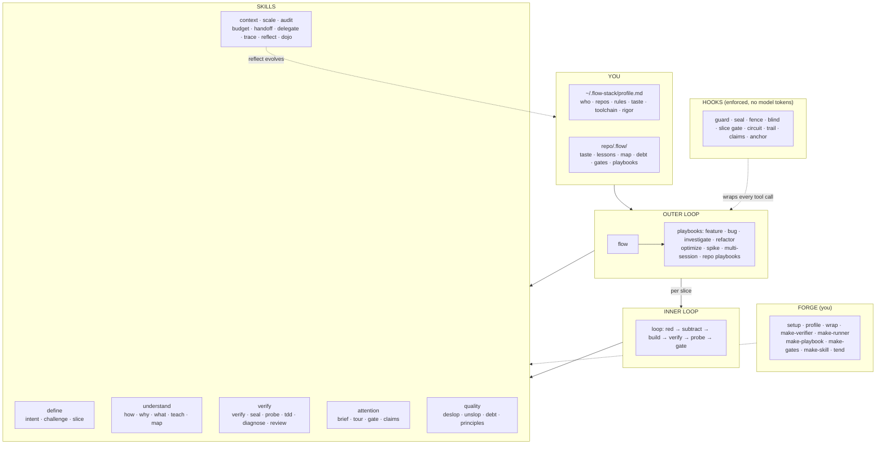
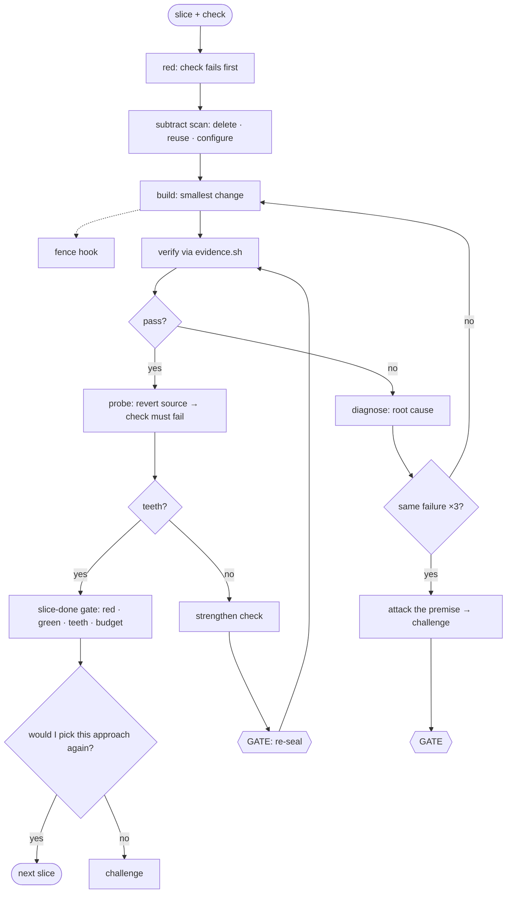

# flow-stack

**Spend human attention like money.** flow-stack is a Claude Code plugin that makes the agent define "done" before coding, prove its work with evidence it can't fake, stop fixating on its first idea, prefer deleting code to adding it, and keep a trail you can audit. It adapts to the tools you already use.

It is built from skills, bash + jq hooks, and existing tools. There is no new runtime. It was inspired by [gstack](https://github.com/garrytan/gstack), [pstack](https://github.com/cursor/plugins/tree/main/pstack), and [mattpocock/skills](https://github.com/mattpocock/skills).

- [Quick start](#quick-start)
- [How you use it day to day](#how-you-use-it-day-to-day)
- [When to use what](#when-to-use-what)
- [Skill catalog](#skill-catalog)
- [What it costs, and how it keeps cost down](#what-it-costs-and-how-it-keeps-cost-down)
- [Guardrails (hooks)](#guardrails-hooks)
- [How it works](#how-it-works)
- [Your profile](#your-profile) · [Adapting to your setup](#adapting-to-your-setup) · [Forge](#forge-skills-specific-to-your-repo)
- [Files](#files) · [Limits](#limits) · [Development](#development)

## Quick start

```bash
# inside Claude Code (the repo is private: your git credentials must be able to clone it)
/plugin marketplace add nayanraj210401/flow-stack
/plugin install flow-stack@flow-stack
/flow-stack:setup
```

`setup` learns your existing toolchain, creates `~/.flow-stack/profile.md` from a preset, and offers the helper tools you're missing. It asks before installing anything.

For local development: `claude --plugin-dir ./plugins/flow-stack`.

Requirements: `jq`, `git`, `perl`, `curl`, and `shasum` (standard on macOS and most Linux). Optional tools `setup` can install: rtk, serena, headroom, graphify, ccusage, Playwright MCP, and ntfy.

## How you use it day to day

**Mostly, you just talk.** You don't need to remember skill names:

- **Ask a question** ("how does auth work?"): a short, cited answer. No ceremony.
- **Ask for a one-line fix**: the agent makes it and runs the check.
- **Ask for a feature, a bug fix, a refactor, or a speed-up**: the agent invokes `flow`, which picks a playbook and runs it. You get **three decision points**:
  1. approve the intent and checks,
  2. approve the merge or push,
  3. approve any changes it proposes to your taste profile.
  It asks between them only when a decision is irreversible or a matter of taste.
- **The hooks run on every tool call either way.** They cost no model tokens. They block destructive commands and secret reads, stop tests from being weakened, keep edits in scope, catch fix-loops, and refuse an unverified "done".

Type a skill yourself when you want a specific thing: `/flow-stack:challenge`, `/flow-stack:brief`, `/flow-stack:wrap`.

## When to use what

| Situation | Use | You'll get |
|---|---|---|
| New feature, multi-file change | just ask, or `/flow-stack:flow` | intent → approach → slices → proof → a short review tour |
| Bug with an unknown cause | just describe it, or `/flow-stack:diagnose` | a reproduction first, then the root cause, then a fix with a regression check |
| Refactor, rename, migration | `/flow-stack:flow` (refactor playbook) | behavior pinned first; kept only if the code gets easier to read |
| Make something faster, smaller, cheaper | `/flow-stack:flow` (optimize playbook) | one change, one measurement, keep or revert |
| Not sure what to build | `/flow-stack:flow` (spike playbook) | 2 or 3 throwaway prototypes and a recommendation |
| "Is there a better way?" / you suspect over-engineering | `/flow-stack:challenge` | an independent design plus the delete/reuse/skip option, as a table |
| "What exactly are we building?" | `/flow-stack:intent` | INTENT.md with runnable acceptance checks |
| "How does X work?" / "Why is it like this?" | `how` / `why` | a cited answer (`file:line`, commits, PRs) |
| Understand something deeply | `/flow-stack:teach` | an explanation at your level, then a question to check you got it |
| "What changed?" / catching up | `/flow-stack:what` | the shape of a diff, PR, or the agent's session in about 8 lines |
| Prove it works | `/flow-stack:verify` | evidence recorded from the real app, not "it compiles" |
| Before you review a diff | `/flow-stack:tour` | what to read, skim, or skip, and why |
| Reply too long | `/flow-stack:brief` | the last reply in 3 plain lines |
| Clean up a diff / prose | `/flow-stack:deslop` / `/flow-stack:unslop` | slop removed, graded against your taste |
| Context filling up / stopping for the day | `/flow-stack:handoff` | HANDOFF.md; the next session starts with `/flow resume` |
| Many independent slices | `/flow-stack:delegate` | parallel worktree workers, capped by your review budget |
| Audit what the agent did | `/flow-stack:trace` | TRACE.md: timeline, who decided what, evidence, cost |
| End of day | `/flow-stack:wrap` | shipped, waiting on you, and your first step tomorrow |
| After a frustrating session | `/flow-stack:reflect` | proposed taste and lesson updates you approve |
| New repo | `/flow-stack:setup` then `/flow-stack:make-verifier` | a driver that proves this app works the way a user uses it |
| Installed a new plugin or hook | `/flow-stack:setup adapt` | flow-stack re-fits itself around your toolchain |

## Skill catalog

**Invoked** says who triggers the skill:
- *auto*: the model picks it up from context.
- *flow*: `flow` calls it at the right step.
- *you*: you type it (these don't appear in the model's skill list, which saves tokens).

**Agent** means the skill spawns a subagent, the most expensive kind of step. Subagents run on Sonnet by default.

### Orchestration

| Skill | Invoked | What it does |
|---|---|---|
| `flow` | auto · you | The outer loop. It classifies the request and runs a playbook (feature, bug, investigate, refactor, optimize, spike, multi-session, or your repo's own) with human gates. Scales its ceremony by `rigor`. |
| `loop` | flow | The inner loop for one slice: red → subtract scan → build → verify → probe → proof-gated done, with a circuit breaker. |

### Define

| Skill | Invoked | What it does |
|---|---|---|
| `intent` | auto · flow | A short grilling interview (it answers from the code whatever the code can answer) → INTENT.md with goal, non-goals, and runnable checks. Blind checks are written by the `checker` agent. **Agent** (blind checks only) |
| `challenge` | auto · flow | Breaks fixation. The `advocate` agent designs from the goal alone, never seeing our approach, then attacks ours. The null option (delete, reuse, configure, don't build) is always weighed. **Agent** |
| `slice` | flow | Splits the work into slices, each with one check, a file fence, and a line budget. The first slice is a thin end-to-end tracer. |

### Understand

| Skill | Invoked | What it does |
|---|---|---|
| `how` | auto | How code works: runtime flow, ownership, where a change belongs. Cites `file:line`. |
| `why` | auto | Why it's built this way, from git log and blame, PRs, issues, and docs, with a confidence level. |
| `what` | auto | A summary of a diff, PR, branch, module, or the agent's session. |
| `teach` | auto · you | A deep explanation at your level (from the profile), ending with a check for understanding. |
| `map` | auto · flow | Builds `.flow/map.md` once, so later sessions read it instead of re-exploring the repo. |

### Verify

| Skill | Invoked | What it does |
|---|---|---|
| `verify` | auto · flow | Runs checks on the real artifact through `evidence.sh` (the only way to write EVIDENCE.md), uses your repo's driver, and runs the blind checks. |
| `seal` | flow | Hashes the approved checks. Editing one then needs your confirmation. |
| `probe` | flow | Reverts the change and re-runs the check. If it still passes, the check proves nothing (TOOTHLESS). |
| `tdd` | auto | Red → green → refactor for fast checks. The slice-done gate enforces the cadence. |
| `diagnose` | auto · flow | Reproduce as a failing check → hypotheses → observations → root cause. No symptom patches. |
| `review` | flow · you | The `reviewer` agent grades the diff against INTENT, EVIDENCE, and your taste, and asks whether fewer lines could do it. **Agent** |

### Attention (your time)

| Skill | Invoked | What it does |
|---|---|---|
| `brief` | always on · you | The reply contract: answer first, ≤ 5 lines. `/brief` restates the last reply plainly. |
| `tour` | flow · you | A risk-ranked diff: READ / SKIM / SKIP with reasons, net lines, and estimated review minutes. |
| `gate` | auto | Classifies decisions: reversible ones proceed and are logged; irreversible or taste ones are asked, batched into one message, and you're notified. |
| `claims` | auto | Tags every statement `✓ verified (evidence)` or `~ assumed`. The Stop hook enforces it for "done". |

### Quality

| Skill | Invoked | What it does |
|---|---|---|
| `deslop` | auto · flow | Removes code slop from the diff (narrating comments, dead code, defensive clutter, one-caller wrappers, duplicate helpers). Behavior must stay green. |
| `unslop` | auto · flow | Removes AI tells from replies, commits, PRs, and docs. |
| `debt` | flow · you | A ledger of shortcuts taken, each with a repay trigger. |
| `principles` | auto | 18 principles (design-it-twice, subtract-before-add, red-before-green, evidence-over-claims, …). Each loads on demand as one short file. |

### Context, scale, audit

| Skill | Invoked | What it does |
|---|---|---|
| `budget` | auto · you | Context and cost rules (subagents for bulk reading, cheap models, symbol reads, the handoff threshold). `/budget` reports spend. |
| `handoff` | auto · you | Writes HANDOFF.md for a cold resume. `/handoff resume` loads it. |
| `delegate` | you · flow | Parallel worktree `worker` agents, capped by `attention.max_parallel_agents`. A result is accepted only with evidence and a review. **Agent** |
| `trace` | flow · you | Writes TRACE.md from the trail, decisions, evidence, git, and cost, including estimate vs. actual. |
| `reflect` | flow · you | Proposes taste, lesson, and calibration updates from your corrections. Prefers encoding a lesson as a lint rule over prose. |
| `dojo` | flow · you | Keeps your skills sharp: leaves a `TODO(you)` piece, or asks an explain-back question. Off by default. |

### Setup and forge (you invoke these)

| Skill | What it does |
|---|---|
| `setup` | Learns your toolchain and usage, adapts to it, creates your profile, offers tools, and runs a forge census. `/flow-stack:setup adapt` re-fits after changes. |
| `profile` | Shows, edits, or lints `~/.flow-stack/profile.md`. |
| `wrap` | End-of-day digest across your repos. |
| `make-verifier` | Generates `.claude/skills/verify-<repo>/`, a driver that runs this app like a user (CLI, HTTP, browser) and proves itself on a real feature. |
| `make-runner` | Generates `.claude/skills/run-<repo>/` with verified install, start, seed, reset, and stop commands. |
| `make-playbook` | Generates `.flow/playbooks/<name>.md` from past traces, for workflows this repo repeats. |
| `make-gates` | Generates `.flow/gates.md`: this repo's irreversible commands as deny/ask rules the guard hook enforces. |
| `make-skill` | Generates any other repo or personal skill, with a self-test. |
| `tend` | Re-runs every generated skill's self-test and flags drift against the code. |

### Agents

| Agent | Spawned by | Sees |
|---|---|---|
| `advocate` | challenge | the problem only (design mode), then our approach (attack mode) |
| `checker` | intent | INTENT; writes held-out blind checks and returns only a count |
| `reviewer` | review | INTENT, the diff, EVIDENCE, taste; read-only |
| `worker` | delegate | one slice, in its own worktree; never the blind checks |

## What it costs, and how it keeps cost down

flow-stack writes files and makes decisions, and that costs something. These are the numbers, measured with `claude plugin eval` against the same tasks without the plugin.

### Measured overhead

| | Tokens | When |
|---|---|---|
| Skill list the model sees | ≈ 1.6k | every session (cached after the first turn) |
| SessionStart context (profile, rules, taste, active task) | ≈ 0.3–0.5k | every session |
| Intent anchor | ≈ 40 | every prompt, only while a task is active |
| `flow` + a playbook + conventions | ≈ 3.6k | only when a non-trivial task starts |

On small eval tasks, where fixed overhead dominates, a session with the plugin costs **1.43×** a plain session on average. That was **1.78×** before the optimizations below.

| Kind of task | With / without |
|---|---|
| Quick question / feature routing | 1.1× |
| Intent writing | 1.0× |
| One-turn replies | 1.2–1.5× (about +$0.02 fixed) |
| `challenge` (spawns an agent) | 2.8× |

The numbers above are the price side. The value side is what the evals show the plugin prevents:
- weakened tests (the seal case fails without the plugin),
- `.env` secrets reaching the transcript,
- helpers duplicated instead of reused (the least-code case scores 0.33 without the plugin, 1.0 with it),
- new modules built when one already existed.

A rework loop or a wrong approach usually costs more than the overhead. Judge it on your own traces: `trace` records estimate vs. actual for every task.

### How cost is kept down

1. **Bookkeeping is bash, not the model.** Evidence, seals, probes, blind-check runs, the audit trail, the auto handoff, diffstat, and the slice-done proofs are shell scripts and hooks. They cost zero model tokens, which is why no rigor level turns them off.
2. **Small always-on footprint.** The 18 principles are one skill with on-demand files. The nine skills you invoke yourself (setup, forge, wrap…) are hidden from the model's list. Descriptions are kept to their trigger phrases. Together these cut the always-on listing from about 4.8k to about 1.6k tokens.
3. **Ceremony scales with the task.** Questions and one-line edits skip the task folder entirely. For real tasks, `rigor` in your profile decides what runs:

   | Step | lean | standard (default) | strict |
   |---|---|---|---|
   | Blind checks (agent) | skip | when a contract changes | always |
   | `challenge` (agent) | on request, or when the circuit trips | multi-slice features and refactors | every task |
   | `review` (agent) | only for diffs over 300 lines | one reviewer | one per area, in parallel |
   | Evidence, seals, probe, slice gate (bash) | on | on | on |
   | Trace / reflect | on request | at close | at close |

   The solo-hacker preset uses `lean`. Override per task by saying "quick" or "go strict".
4. **Cheaper models where judgment isn't needed.** Subagents run on Sonnet by default, even when your session runs on Opus. Exploration goes to `budget.subagent_model` (default Haiku).
5. **Files instead of re-reading.** `map.md` replaces re-exploring the repo each session. HANDOFF.md replaces a lossy compaction. The anchor re-injects 3 lines instead of re-reading INTENT.
6. **Loops are stopped early.** The circuit breaker trips after the same failure three times, the most expensive pattern in agent work.
7. **Uses what you already have.** `setup` records your token savers (rtk, headroom, serena) and delegates to tools you already pay for, instead of duplicating them.

Check your own spend with `/flow-stack:budget` (uses ccusage) and the estimate-vs-actual row in each TRACE.md.

## Guardrails (hooks)

| Hook | Blocks or does |
|---|---|
| **guard** (Bash) | Denies `rm -rf /`, force-push to main, reading `.env`, and packages that don't exist on npm or PyPI (hallucinated dependencies). Asks you before `reset --hard`, destructive SQL, `curl \| sh`, and anything in your repo's `.flow/gates.md`. |
| **seal** (Edit, Write, Bash) | Editing a sealed check, INTENT.md, or SEALS needs your confirmation. |
| **fence** (Edit, Write) | Edits outside the current slice's file fence are denied until the fence is widened on purpose and logged. |
| **blind / read-guard** | Blind checks and `.env` files can't be read by the builder. |
| **slice gate** | `status: done` can only be set by `task.sh slice <id> done`, which requires red first, green after the last edit, probe TEETH, and the line budget. |
| **circuit** (PostToolUse) | The same failing check 3 times → stop, attack the premise, `challenge`, and ask you. |
| **trail** (PostToolUse) | Every tool call goes to `trail.jsonl` with secrets redacted. |
| **claims** (Stop) | "Done", "works", or "fixed" with no passing evidence since the last edit → sent back once to verify or say `~ assumed`. |
| **anchor** (UserPromptSubmit) | A 3-line goal and slice reminder on every prompt while a task is active. |
| **session-start / pre-compact / notify** | Profile and toolchain context; a handoff snapshot before compaction; a notification when the agent is blocked on you. |

Hooks fail open: if `jq` is missing or a script errors, the action is allowed and a warning goes to `~/.flow-stack/hooks.log`. Turn any hook off in `.flow/config.json` (repo) or `~/.flow-stack/config.json` (global): `{"hooks": {"fence": false}}`.

## How it works



### Outer loop (`flow`, feature playbook)


### Inner loop (`loop`)



### Anti-reward-hacking

Agents saturate visible tests while real correctness varies. flow-stack has three layers against this:

1. **Seal.** Approved checks are hashed, and changing them needs you.
2. **Probe.** A check that still passes with the change reverted is TOOTHLESS.
3. **Blind checks.** The `checker` agent writes held-out checks that the builder can't read. `blind-run.sh` reports only the verdict and the failing test names.

In testing, a special-cased `mul() { echo 6; }` passed the visible check and failed the blind one.

## Your profile

`~/.flow-stack/profile.md` is created by `setup` from a preset: senior-backend, frontend-product, data-ml, learning-mode, or solo-hacker.

| Section | Used for |
|---|---|
| frontmatter | attention budget, models, `rigor`, notifications, `dojo` |
| Who | how deep explanations go |
| Repos | only the current repo's entry is injected |
| Rules | ≤ 20 hard constraints, always injected |
| Taste | dated, sourced preferences; the rubric for deslop, unslop, review, and brief |
| Toolchain | how flow-stack fits your other tools |
| Keep-sharp | what `dojo` leaves to you |
| Calibration | estimate vs. actual, learned by `reflect` |

Taste evolves: `reflect` proposes changes from your corrections, you approve each one, and retired entries move to `# Taste history`. Repo taste (`.flow/taste.md`) overrides personal taste.

## Adapting to your setup

`setup` starts by learning your toolchain:
- installed plugins, with their skills and hooks,
- your own hooks,
- MCP servers,
- your status line,
- your CLAUDE.md,
- and, from local transcripts, **what you actually use**.

Then it fits around it:

- **One router.** If you use `pstack:poteto-mode`, it stays your router, and flow-stack stops pushing `flow`.
- **Delegation.** Capabilities you already cover go to your tool (`how → pstack:how`, `verify-driver → gstack /qa`). Seals, evidence, claims, the trail, and gates stay with flow-stack.
- **Coexistence.** Your status line is chained, not replaced. Overlapping hooks are noted or turned off.
- **Recorded** as `# Toolchain` lines in your profile. A fingerprint detects toolchain changes, and the next session suggests `/flow-stack:setup adapt`.

## Forge: skills specific to your repo

Generic skills have **slots**. Forge skills generate what fills them. Resolution order: your Toolchain → repo-local → user-local → the default.

| Slot | Filled by | Lives at |
|---|---|---|
| Drive the app like a user | `make-verifier` | `.claude/skills/verify-<repo>/` |
| Build, run, reset | `make-runner` | `.claude/skills/run-<repo>/` |
| Repo workflows | `make-playbook` | `.flow/playbooks/*.md` |
| Irreversible actions | `make-gates` | `.flow/gates.md` |
| Anything else | `make-skill` | `.claude/skills/<name>/` |

Every generated skill has a `## Self-test` and a `source-commit`. `tend` re-runs the self-tests and flags drift.

## Files

```
~/.flow-stack/profile.md, config.json, toolchain.fp      you
<repo>/.flow/config.json                                  commands + hook toggles   (commit)
<repo>/.flow/{taste,gates,lessons,map,debt}.md, playbooks/                          (commit)
<repo>/.flow/tasks/<slug>/   INTENT · SLICES · SEALS · blind/ · EVIDENCE · DECISIONS.tsv
                             trail.jsonl · HANDOFF · TRACE                          (gitignored)
```

## Limits

- Blind checks and the guard hook are defense in depth, not a sandbox. A determined agent with a shell can find files. They stop honest agents from fitting code to checks by accident, and make cheating visible in the trail.
- The claims check reads the last message for success words. It catches an unverified "done", not every overclaim.
- The circuit breaker only counts checks run through `evidence.sh`.
- The package-existence check needs network access (3-second timeout, fails open).
- `challenge` doesn't always fire on its own for a question with no code involved; the answer still compares options. Invoke `/flow-stack:challenge` to force it.
- Cost numbers come from small eval tasks. Long tasks spread the fixed overhead thinner, but verify on your own traces.

## Development

```bash
claude plugin validate --strict plugins/flow-stack
cd plugins/flow-stack
# behavior + cost evals against a no-plugin baseline (see evals/README.md)
claude plugin eval . --tag routing hooks define quality context forge design \
  --scaffold --allow-tools Edit Write Agent --no-publish
```

23 eval cases cover routing, hooks, intent, challenge, least-code, quality, handoff, forge, and setup adaptation. Cases tagged `needs-bash` require a machine where Bash-granting evals are allowed.

License: MIT.
